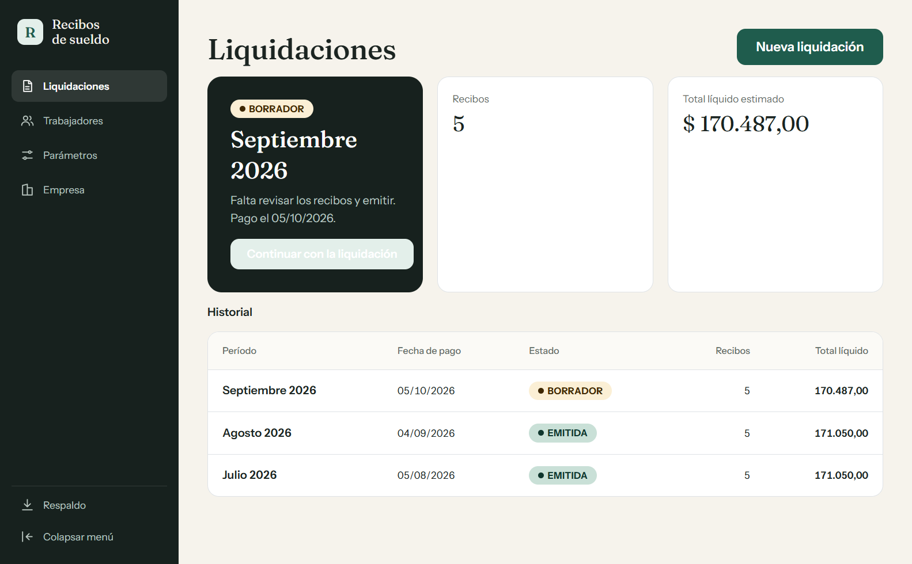
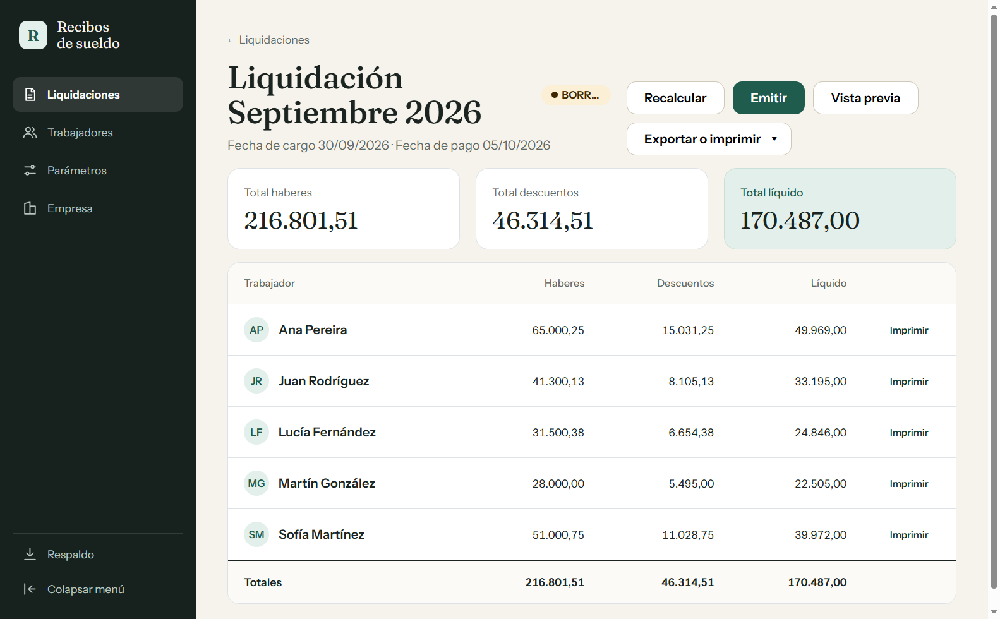
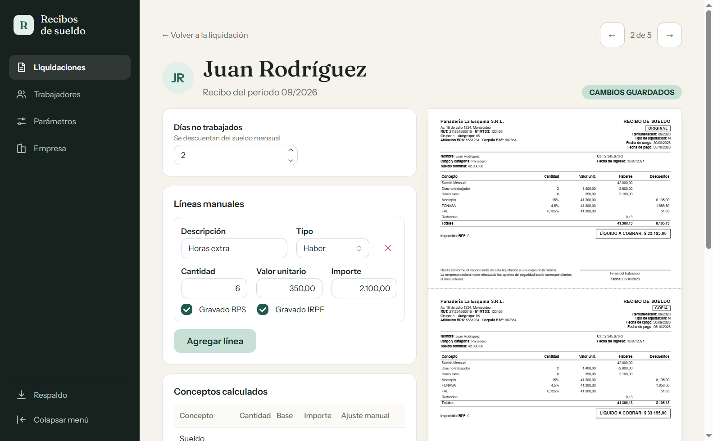
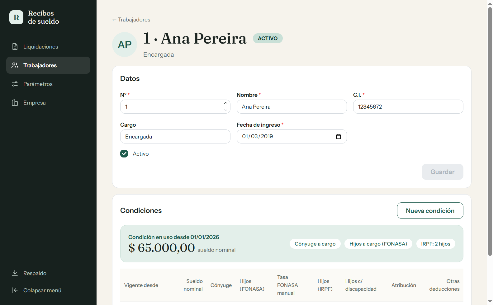
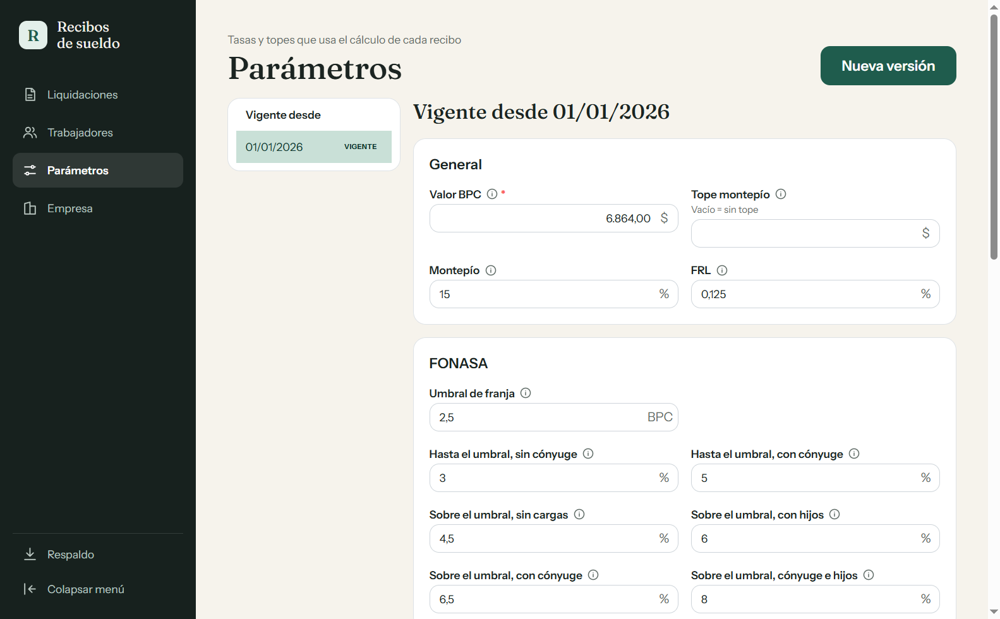
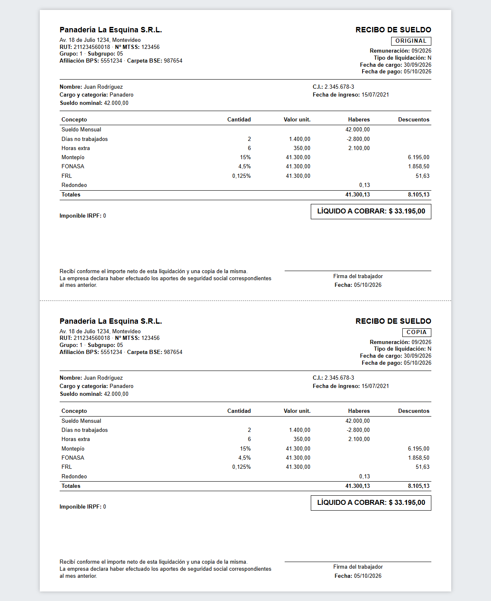

# Recibos de sueldo

App de escritorio para Windows que arma los recibos de sueldo mensuales (liquidación tipo N) de una empresa uruguaya. La hice para dejar de usar la planilla de Excel con la que los veníamos haciendo: los datos se cargan desde la app, quedan guardados en una base local y los recibos salen en PDF o directo a la impresora. No hace falta tener Excel instalado.



## Qué hace

- Guarda los datos de la empresa (RUT, MTSS, BPS, BSE, grupo y subgrupo) que van en el encabezado de cada recibo.
- Lleva la lista de trabajadores con sus condiciones: sueldo nominal, cónyuge e hijos para FONASA, hijos y deducciones para IRPF. Las condiciones tienen fecha de vigencia, así que un aumento no pisa los meses anteriores.
- Calcula montepío, FONASA, FRL e IRPF a partir de los parámetros vigentes (BPC, tasas, franjas). Los parámetros también se versionan por fecha y se editan desde la app, no hay nada legal escrito en el código.
- Arma la liquidación del mes con un recibo por cada trabajador activo. Mientras está en borrador se pueden cargar días no trabajados, agregar líneas a mano (horas extra, adelantos, lo que sea) y corregir una tasa o el IRPF si hace falta.
- El líquido se redondea siempre hacia arriba al peso siguiente.
- Al emitir, la liquidación queda congelada con los datos de ese momento. Si hay que corregir algo se puede reabrir.
- Exporta los recibos a PDF (uno solo o uno por trabajador) o los manda a imprimir, original y copia en la misma hoja.
- Hace respaldos de la base de datos a la carpeta que elijas.

Lo que no hace, por ahora: aguinaldo, salario vacacional, egresos, licencias, jornaleros ni importar las planillas viejas.

## Capturas

Las capturas usan datos inventados.

La liquidación del mes, con los totales y un recibo por trabajador:



El editor de cada recibo, con la vista previa al lado:



La ficha de un trabajador y sus condiciones:



Los parámetros legales:



Y así sale el recibo impreso:



## Instalación

Bajá la última versión desde [Releases](https://github.com/marcobaldi97/uy-paycheck-generator/releases). Hay dos opciones:

- `Recibos de sueldo-<versión>-setup.exe`: el instalador.
- `Recibos de sueldo-<versión>-portable.exe`: se ejecuta sin instalar nada.

Los datos quedan en `%APPDATA%\Recibos de sueldo\recibos.db`. Conviene hacer un respaldo desde la pantalla Respaldo cada tanto, sobre todo antes de actualizar.

## Cómo se usa

1. Completá los datos de la empresa.
2. Revisá que los parámetros (BPC, tasas, franjas de IRPF) estén al día. Si cambian, creá una versión nueva con la fecha desde la que rigen.
3. Cargá los trabajadores y la condición de cada uno.
4. Creá la liquidación del mes. Se genera un recibo por cada trabajador activo.
5. Revisá los recibos, ajustá lo que haga falta y emití.
6. Exportá o imprimí.

## Desarrollo

Necesitás Node 24 (está en `.nvmrc`).

```bash
npm install
```

```bash
npm run dev
```

Antes de mergear tienen que pasar:

```bash
npm run typecheck
```

```bash
npm run lint
```

```bash
npm test
```

Si tocaste algo en `src/main`, corré también `npm run test:db`, que prueba la base de datos dentro de Electron.

Para generar los ejecutables en `dist/`:

```bash
npm run package
```

Cuando sube la versión en `package.json` y se mergea a `master`, GitHub Actions publica un release con los dos `.exe`.

Está hecho con Electron, React, Mantine, SQLite (better-sqlite3 + Drizzle) y decimal.js para las cuentas. Los montos se guardan en centésimos y el cálculo vive todo en el proceso principal; la interfaz solo muestra lo que le devuelve. Los detalles de la arquitectura están en [CLAUDE.md](CLAUDE.md) y el plan completo en [PLAN.md](PLAN.md).
